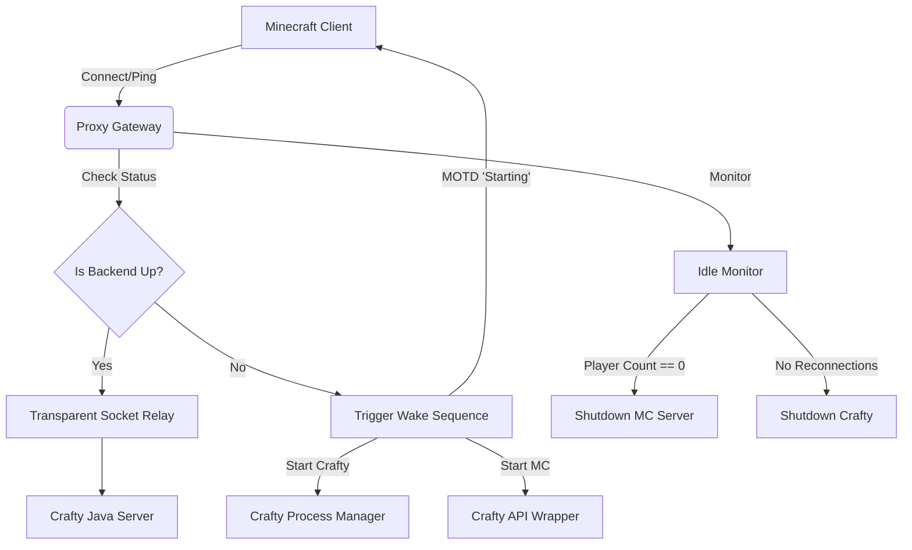

# Minecraft Autostart Gateway

This is an on-demand autostart/shutdown gateway for a Minecraft server managed by Crafty Controller.

It implements a transparent socket proxy:
- Listens on a public port and proxies Minecraft traffic to a local Crafty-managed Java server.
- If the backend is down, it triggers Crafty + the MC server to start, showing MOTD/kick messages natively over the Minecraft protocol until it is ready.
- Tracks player idle time, turning off the MC server, then Crafty, after configurable periods of inactivity.
- Supports SIGHUP for hot-reloading a subset of config values.

## Architecture Diagram



## Configuration

Configuration can be provided by environment variables or `config.toml`. **Environment variables take precedence over the TOML file**.

| Key | Type | Default | Description |
|-----|------|---------|-------------|
| `CRAFTY_URL` | String | - | URL to the Crafty Controller API |
| `CRAFTY_TOKEN` | String | - | API Token for Crafty Controller |
| `SERVER_ID` | String | - | The UUID of the server to manage |
| `CRAFTY_DIR` | String | - | The base directory of your Crafty 4 installation |
| `MC_PUBLIC_PORT` | Integer | - | The port this proxy listens on |
| `MC_INTERNAL_HOST` | String | `127.0.0.1` | The backend IP Crafty binds the server to |
| `MC_INTERNAL_PORT` | Integer | `25565` | The backend port Crafty binds the server to |
| `IDLE_LIMIT_SECONDS` | Integer | `600` | Inactivity limit before MC is shut down [HOTSWAP] |
| `CRAFTY_IDLE_SECONDS`| Integer | `300` | Grace period after MC shutdown before Crafty shuts down [HOTSWAP] |
| `CHECK_INTERVAL_SECONDS` | Integer | `20` | Interval between player count queries [HOTSWAP] |
| `STARTUP_TIMEOUT_SECONDS` | Integer | `180` | Wait limit for backend boot-up |
| `LOG_FILE` | String | `gateway.log` | Path for gateway log rotation |
| `LOG_MAX_BYTES` | String/Int | `10 MB` | File rotation limit. Bytes, MB, GB, etc. |
| `LOG_BACKUP_COUNT` | Integer | `3` | Max rotated log backups to retain |
| `LOG_TO_STDOUT` | Boolean | `True` | Whether gateway logs are also printed to stdout |
| `LOG_SUPPRESS_WINDOW_SECONDS` | Integer | `60` | Time window in seconds to suppress repeated connection logs from the same IP |
| `LOG_FORMAT` | String | `text` | Log output format, can be `text` or `json` |
| `CRAFTY_LOG_FILE` | String | `crafty.log` | Path for Crafty's own rotating log file |
| `CRAFTY_LOG_MAX_BYTES` | String/Int | `20 MB` | Rotation size limit for the Crafty log (e.g. `20 MB`) |
| `CRAFTY_LOG_BACKUP_COUNT` | Integer | `3` | Max rotated Crafty log backups to retain |
| `CRAFTY_LOG_LEVEL` | String | `INFO` | Filtering for crafty output (`INFO` or `WARNING`) [HOTSWAP] |
| `MOTD_DORMIDO` | String | `Server dormido...` | MOTD text shown in server list while backend is asleep (supports `{idle_min}`, `{crafty_idle_min}`, `{startup_timeout_seg}`) |
| `MOTD_INICIANDO` | String | `El server se está iniciando...` | MOTD text shown in server list while backend is starting up (supports `{idle_min}`, `{crafty_idle_min}`, `{startup_timeout_seg}`) |
| `KICK_MENSAJE` | String | `El server se está iniciando...` | Kick message if player connects before backend is ready (supports `{idle_min}`, `{crafty_idle_min}`, `{startup_timeout_seg}`) |

### Config File Location

By default, the gateway expects to find `config.toml` in the **current working directory** (the directory you run the gateway from).
You can override this location by setting the `CONFIG_FILE` environment variable to a specific file path.

**⚠️ Warning:** Relative paths in your configuration (like `CRAFTY_DIR`, `LOG_FILE`, or `CRAFTY_LOG_FILE`) are resolved relative to the **current working directory**, *not* the location of the `config.toml` file. To avoid surprising behavior if the gateway is launched from a different working directory, it's recommended to use absolute paths in `config.toml`.

### Security Warning

On startup, the gateway checks if the config file containing `CRAFTY_TOKEN` is world-readable. If so, it logs a visible warning to prompt you to secure it. This is a warning only and will not prevent the gateway from starting. The exact warning message logged is:

> `WARNING: <path> is world-readable and contains a secret token. Run: chmod 600 <path>`

## Migrating from config.sh

If you are upgrading from the older single-script setup (`config.sh` + `start.sh`) to the new modular system, you can migrate your configuration to a `config.toml` file. This migration is optional but recommended. Environment variables from the old `config.sh` will still work as-is and take precedence over TOML keys, so hybrid setups are also supported.

**Step-by-step instructions:**

1. Create a `config.toml` file in the directory where you launch the gateway (or specify it using `CONFIG_FILE`).
2. Move your values from `config.sh` over to the TOML format. Here is an example of what that translated file looks like:

   ```toml
   # Connection
   CRAFTY_URL = "https://localhost:8443"
   CRAFTY_TOKEN = "eyJhbG... (YOUR_TOKEN_HERE)"
   SERVER_ID = "a9f17c0f-8870-40b5-af3a-8947e8c759a2"
   CRAFTY_DIR = "/home/user/Escritorio/MC_Server/crafty-4"

   # Ports
   MC_PUBLIC_PORT = 56768
   MC_INTERNAL_HOST = "127.0.0.1"
   MC_INTERNAL_PORT = 25565

   # Timers
   IDLE_LIMIT_SECONDS = 150
   CRAFTY_IDLE_SECONDS = 300
   CHECK_INTERVAL_SECONDS = 30
   STARTUP_TIMEOUT_SECONDS = 30

   # Messages
   MOTD_DORMIDO = "Estoy ZZZ pibe... Conectate pa despertarme"
   MOTD_INICIANDO = "Para wachin, ya me levanto..."
   KICK_MENSAJE = "Ya me levanto (esperá ~{startup_timeout_seg}s)..."

   # Logs
   LOG_FILE = "/home/user/Escritorio/MC_Server/autostart/gateway.log"
   LOG_MAX_BYTES = "10 MB"
   LOG_BACKUP_COUNT = 3
   LOG_TO_STDOUT = true
   LOG_SUPPRESS_WINDOW_SECONDS = 60

   CRAFTY_LOG_FILE = "/home/user/Escritorio/MC_Server/autostart/crafty.log"
   CRAFTY_LOG_MAX_BYTES = "10 MB"
   CRAFTY_LOG_BACKUP_COUNT = 3
   CRAFTY_LOG_LEVEL = "INFO"
   ```
3. Update your launcher (e.g. `start.sh` or systemd service) so that it no longer sources `config.sh`.
4. Restart the gateway process.
5. Verify that your configuration loaded successfully by checking the startup log line. You should see a message similar to:
   `Config loaded: source=toml file=config.toml (env var overrides applied: [])`

## Hot-Reloading

You can adjust certain timers and log levels without restarting the gateway process if you are using `config.toml`. Environment-variable setups do not support hot-reloading.

1. Make changes to the `[HOTSWAP]` tagged variables in `config.toml`.
2. Find the PID of the gateway.
3. Send the `SIGHUP` signal: `kill -HUP <PID>`

## Setup / Development

Install standard development tools such as `pytest`, `mypy`, and `ruff` via optional dependencies:

```bash
pip install -e .[dev]
```

Run test suite:
```bash
pytest
```
