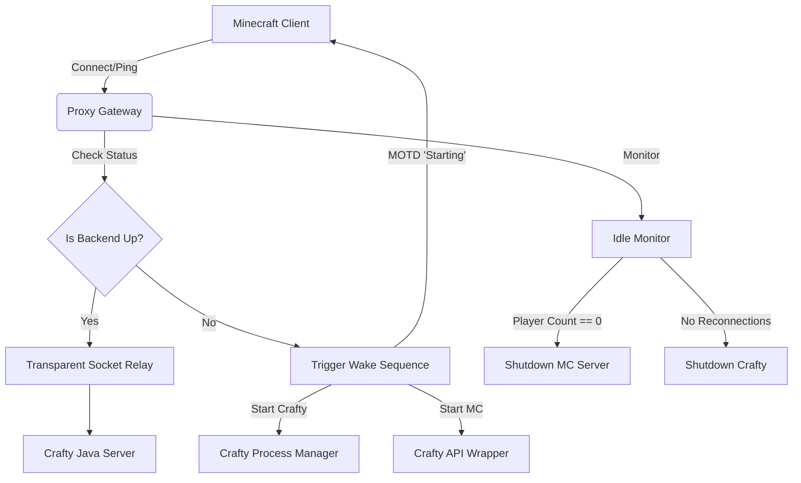

# Minecraft Autostart Gateway

This is an on-demand autostart/shutdown gateway for a Minecraft server managed by Crafty Controller.

It implements a transparent socket proxy:
- Listens on a public port and proxies Minecraft traffic to a local Crafty-managed Java server.
- If the backend is down, it triggers Crafty + the MC server to start, showing MOTD/kick messages natively over the Minecraft protocol until it is ready.
- Tracks player idle time, turning off the MC server, then Crafty, after configurable periods of inactivity.
- Supports SIGHUP for hot-reloading a subset of config values.

## Architecture Diagram



## Configuration

Configuration can be provided by environment variables or `config.toml`. **Environment variables take precedence over the TOML file**.

| Key | Type | Default | Description |
|-----|------|---------|-------------|
| `CRAFTY_URL` | String | - | URL to the Crafty Controller API |
| `CRAFTY_TOKEN` | String | - | API Token for Crafty Controller |
| `SERVER_ID` | String | - | The UUID of the server to manage |
| `CRAFTY_DIR` | String | - | The base directory of your Crafty 4 installation |
| `MC_PUBLIC_PORT` | Integer | - | The port this proxy listens on |
| `MC_INTERNAL_HOST` | String | `127.0.0.1` | The backend IP Crafty binds the server to |
| `MC_INTERNAL_PORT` | Integer | `25565` | The backend port Crafty binds the server to |
| `IDLE_LIMIT_SECONDS` | Integer | `600` | Inactivity limit before MC is shut down [HOTSWAP] |
| `CRAFTY_IDLE_SECONDS`| Integer | `300` | Grace period after MC shutdown before Crafty shuts down [HOTSWAP] |
| `CHECK_INTERVAL_SECONDS` | Integer | `20` | Interval between player count queries [HOTSWAP] |
| `STARTUP_TIMEOUT_SECONDS` | Integer | `180` | Wait limit for backend boot-up |
| `LOG_FILE` | String | `gateway.log` | Path for gateway log rotation |
| `LOG_MAX_BYTES` | String/Int | `10 MB` | File rotation limit. Bytes, MB, GB, etc. |
| `LOG_BACKUP_COUNT` | Integer | `3` | Max rotated log backups to retain |
| `LOG_FORMAT` | String | `text` | Log output format, can be `text` or `json` |
| `CRAFTY_LOG_LEVEL` | String | `INFO` | Filtering for crafty output (`INFO` or `WARNING`) [HOTSWAP] |

## Hot-Reloading

You can adjust certain timers and log levels without restarting the gateway process if you are using `config.toml`. Environment-variable setups do not support hot-reloading.

1. Make changes to the `[HOTSWAP]` tagged variables in `config.toml`.
2. Find the PID of the gateway.
3. Send the `SIGHUP` signal: `kill -HUP <PID>`

## Setup / Development

Install standard development tools such as `pytest`, `mypy`, and `ruff` via optional dependencies:

```bash
pip install -e .[dev]
```

Run test suite:
```bash
pytest
```
